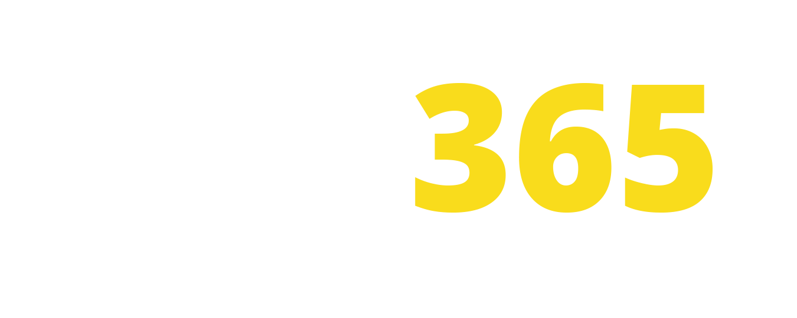
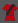

<!DOCTYPE html>
<html lang="en">
  <head>
    <meta charset="UTF-8" />
    <meta http-equiv="X-UA-Compatible" content="IE=edge" />
    <meta name="viewport" content="width=device-width, initial-scale=1.0" />
    <title>Document</title>
    <link rel="stylesheet" href="./css/bet365.css" />
    <link rel="preconnect" href="https://fonts.googleapis.com" />
    <link rel="preconnect" href="https://fonts.gstatic.com" crossorigin />
    <link
      href="https://fonts.googleapis.com/css2?family=Open+Sans:wght@300;400;600;700;800&display=swap"
      rel="stylesheet"
    />
  </head>

  <body>
    
Hola que tal

    <section class="header">
      <ul class="listUpper">
        <li class="liUpper"><a class="textdeporte" href="">Deportes</a></li>
        <li class="liUpper"><a class="textheader1" href="">Directo</a></li>
        <li class="liUpper"><a class="textheader1" href="">Casino</a></li>
        <li class="liUpper"><a class="textheader1" href="">Poquer</a></li>
        <li class="liUpper"><a class="textheader1" href="">Tragaperra</a></li>
        <li class="liUpper"><a class="textheader1" href="">Extra</a></li>
      </ul>
      <ul class="listUpper2">
        <li class="liUpper2"><a class="textheader1" href="">Juego responsable</a></li>
        <li class="liUpper3"><a class="textheader1" href="">Ayuda</a></li>
      </ul>
    </section>
    <section class="header2">
      
      <ul class="listheader2">
        <li class="liheader2">
          <a class="textheader" href="">Deportes</a>
          

        </li>
        <li class="liheader4"><a class="textheader2" href="">Directo</a></li>
        
        <li class="liheader3"><a class="textheader" href="">Registrarse</a></li>
        <button class="iniciar">Iniciar sesión</button>
      </ul>
    </section>
    <section class="nav">
      <ul class="betnav">
        <li class="betnavli"><a href="">Ofertas</a></li>
        <li class="betnavli"><a href="">Euro 2020</a></li>
        <h3 class="listacompleta">LISTA COMPLETA</h3>
        <li class="betnavli"><a href="">Baloncesto</a></li>
        <li class="betnavli"><a href="">Balonmano</a></li>
        <li class="betnavli"><a href="">Béisbol</a></li>
        <li class="betnavli"><a href="">Billar</a></li>
        <li class="betnavli"><a href="">Boxeo/ MMA</a></li>
        <li class="betnavli"><a href="">Carreras de caballos</a></li>
        <li class="betnavli"><a href="">Carreras de galgos</a></li>
        <li class="betnavli"><a href="">Ciclismo</a></li>
        <li class="betnavli"><a href="">Dardos</a></li>
        <li class="betnavli"><a href="">Deportes de invierno</a></li>
        <li class="betnavli"><a href="">Especiales</a></li>
        <li class="betnavli"><a href="">eSports</a></li>
        <li class="betnavli"><a href="">Fútbol</a></li>
        <li class="betnavli"><a href="">Fútbol americano</a></li>
        <li class="betnavli"><a href="">Fútbol sala</a></li>
        <li class="betnavli"><a href="">Golf</a></li>
        <li class="betnavli"><a href="">Hockey</a></li>
        <li class="betnavli"><a href="">Hockey sobre hielo</a></li>
        <li class="betnavli"><a href="">Motor</a></li>
        <li class="betnavli"><a href="">Política</a></li>
        <li class="betnavli"><a href="">Motor</a></li>
        <li class="betnavli"><a href="">Rugby league</a></li>
        <li class="betnavli"><a href="">Rugby union</a></li>
        <li class="betnavli"><a href="">Snooker</a></li>
        <li class="betnavli"><a href="">Speedway</a></li>
        <li class="betnavli"><a href="">Tenis</a></li>
        <li class="betnavli"><a href="">Tenis de mesa</a></li>
        <li class="betnavli"><a href="">Trotones</a></li>
        <li class="betnavli"><a href="">Voleibol</a></li>
        <li class="betnavli"><a href="">Waterpolo</a></li>
      </ul>
    </section>
    <section class="upperContent">
      

        <h3 class="directo">Directo</h3>
        
71 eventos >

      

    </section>
    <section class="upperContent2">
      

        <h3 class="directo2">Fútbol</h3>
      

      

        
1

        
x

        
2

      

    </section>
    <section class="upperContent3">
      

    </section>
    <section class="content">
      

        <h3 class="equipo">Farasganch SC</h3>
        <h3 class="equipo">Dakah city FC</h3>
        <h3 class="equipo minutos">53:22 &nbsp&nbsp23></h3>
      

      

        <h3 class="resultado1">1</h3>
        <h3 class="resultado1">0</h3>
      

      

      

        
1.14

        
6.00

        
26.00

      

    </section>
    <section class="content2">
      

    </section>
    <section class="content3">
      

        <h3 class="equipo">Kashiwa Reysol</h3>
        <h3 class="equipo">Urawa Diamond</h3>
        <h3 class="equipo minutos">74:28 &nbsp&nbsp23></h3>
      

      

        <h3 class="resultado1">0</h3>
        <h3 class="resultado1">1</h3>
      

      

      

        
34.00

        
5.00

        
1.20

      

    </section>
    <section class="content4">
      

    </section>
    <section class="content5">
      

        <h3 class="equipo">Oita</h3>
        <h3 class="equipo">Kashima Antlers</h3>
        <h3 class="equipo minutos">78:15 &nbsp&nbsp23></h3>
      

      

        <h3 class="resultado1">0</h3>
        <h3 class="resultado1">0</h3>
      

      

      

        
8.00

        
1.50

        
3.6

      

    </section>
    <section class="content6">
      

    </section>
    <section class="content7">
      

        <h3 class="equipo">Vegalta Sendai</h3>
        <h3 class="equipo">Shimizu S-Pulse</h3>
        <h3 class="equipo minutos">81:32 &nbsp&nbsp23></h3>
      

      

        <h3 class="resultado1">1</h3>
        <h3 class="resultado1">2</h3>
      

      

      

        
41.00

        
5.5

        
1.16

      

    </section>
    <section class="upperContent4">
      

        <h3 class="directo2">Tenis</h3>
      

      

        
1

        
2

      

    </section>
    <section class="upperContent5">
      

    </section>
    <section class="content8">
      

        

          

        

        

          

        

        

          
Resultado final

        

        

          

        

        

          <input type="number" id="betmoney" placeholder="Establecer cantidad" />
        

        
<button class="dobet">Apostar</button>

      

      

        <h3 class="equipo">Roberto Baena</h3>
        <h3 class="equipo">Sam Querrey</h3>
        <h3 class="equipo minutos">set 3 Juego 23&nbsp&nbsp38></h3>
      

      

        <h3 class="resultado1">1</h3>
        <h3 class="resultado1">1</h3>
      

      

        <h3 class="resultado1">0</h3>
        <h3 class="resultado1">0</h3>
      

      

        <h3 class="resultado1">2</h3>
        <h3 class="resultado1">1</h3>
      

      

      

        
1.4

        
3.1

      

    </section>
    <section class="linea8">
      

    </section>
    <section class="content9">
      

        <h3 class="equipo">Gael Monfils</h3>
        <h3 class="equipo">Max Purcel</h3>
        <h3 class="equipo minutos">set 2 Juego 22&nbsp&nbsp38></h3>
      

      

        <h3 class="resultado1">0</h3>
        <h3 class="resultado1">1</h3>
      

      

        <h3 class="resultado1">6</h3>
        <h3 class="resultado1">5</h3>
      

      

        <h3 class="resultado1">30</h3>
        <h3 class="resultado1">15</h3>
      

      

      

        
1.53

        
2.50

      

    </section>
    <section class="aside">
      

        <h3 class="directo">Euro 2020</h3>
        
Ir al cupón >

      

    </section>
    <section class="aside2">
      

        <h3 class="equipo2">Ucrania</h3>
        <h3 class="equipo2">Austria</h3>
        <h3 class="equipo2">Hoy 18:00</h3>
      

      

      

        

          1 &nbsp&nbsp&nbsp 3.90
        

        

          x &nbsp&nbsp&nbsp 2.10
        

        

          2 &nbsp&nbsp&nbsp 3.10
        

      

    </section>
    <section class="aside3">
      

    </section>
    <section class="aside4">
      

        <h3 class="equipo2">
          Madedonia del norte
        </h3>
        <h3 class="equipo2">Paises bajos</h3>
        <h3 class="equipo2">Hoy 18:00</h3>
      

      

      

        
1 &nbsp&nbsp&nbsp 13.00

        
x &nbsp&nbsp&nbsp 6.50

        
2 &nbsp&nbsp&nbsp 1.22

      

    </section>
    <section class="aside5">
      

    </section>
    <section class="aside6">
      

        <h3 class="equipo2">Finlandia</h3>
        <h3 class="equipo2">Belgica</h3>
        <h3 class="equipo2">Hoy 21:00</h3>
      

      

      

        
1 &nbsp&nbsp&nbsp 11.00

        
x &nbsp&nbsp&nbsp 4.75

        
2 &nbsp&nbsp&nbsp 1.33

      

    </section>
    <section class="aside7">
      

    </section>
    <section class="aside8">
      

        <h3 class="equipo2">Rusia</h3>
        <h3 class="equipo2">Dinamarca</h3>
        <h3 class="equipo2">Mañana 18:00</h3>
      

      

      

        
1 &nbsp&nbsp&nbsp 5.00

        
x &nbsp&nbsp&nbsp 4.00

        
2 &nbsp&nbsp&nbsp 1.65

      

    </section>
    <section class="aside9">
      

    </section>
    <section class="aside10">
      

        <h3 class="equipo2">Republica checa</h3>
        <h3 class="equipo2">Inglaterra</h3>
        <h3 class="equipo2">Mañana 21:00</h3>
      

      

      

        
1 &nbsp&nbsp&nbsp 8.00

        
x &nbsp&nbsp&nbsp 3.60

        
2 &nbsp&nbsp&nbsp 1.53

      

    </section>
    <section class="aside11">
      

    </section>
    <section class="aside12">
      

        <h3 class="equipo2">Croacia</h3>
        <h3 class="equipo2">Escocia</h3>
        <h3 class="equipo2">Mañana 21:00</h3>
      

      

      

        
1 &nbsp&nbsp&nbsp 2.20

        
x &nbsp&nbsp&nbsp 3.80

        
2 &nbsp&nbsp&nbsp 3.0

      

    </section>
    <section class="prefooter">
      

    </section>
    <section class="prefooter2">
      

        
        <h3>&nbsp&nbspOFERTAS</h3>
      

    </section>
    <section class="footer">
      

        

          

            

              <h4>Oferta de dos goles de ventaja</h4>
              

                Apuestas pagadas anticipadamente en encuentros de la Euro 2020 y la Copa America
                2021. Clientes elegibles. Condiciones.   
                Más información
              

            

          

        

        

          

            

              <h4>Combinadas del torneo</h4>
              

                Consiga hasta un 70% más en combinadas de la Euro 2020 y la Copa America 2021.
                Clientes elegibles. Se aplican las condiciones.   
                Más información
              

            

          

        

        

          

            

              <h4>Oferta de 20 puntos de ventaja - NBA</h4>
              

                Apuestas pagadas anticipadamente. Oferta disponible para clientes plenamente
                verificados y elegibles 30 días tras abrir una cuenta. Condiciones.   
                Más info
              

            

          

        

      

    </section>
    <section class="footerlinea">
      

    </section>
    <section class="footer2">
      

        

          <ul>
            <li class="titulolink">Ayuda</li>
            <li class="enlacesfooter">Ingresos</li>
            <li class="enlacesfooter">Retiradas</li>
            <li class="enlacesfooter">Preguntas frecuentes</li>
            <li class="enlacesfooter">Condiciones generales</li>
            <li class="enlacesfooter">Juego responsable</li>
            <li class="enlacesfooter">Problemas técnicos</li>
            <li class="enlacesfooter">Política de privacidad</li>
            <li class="enlacesfooter">Política de cookies</li>
            <li class="enlacesfooter">Reclamaciones</li>
            <li class="enlacesfooter">Reglas</li>
            <li class="enlacesfooter">Información empresa</li>
          </ul>
        

        

          <ul>
            <li class="titulolink">Estadísticas</li>
            <li class="enlacesfooter">Fútbol</li>
            <li class="enlacesfooter">Deportes</li>
            <li class="titulolink">Marcador/Resultado</li>
            <li class="enlacesfooter">Marcador en directo</li>
            <li class="enlacesfooter">Resultados</li>
          </ul>
        

        

          <ul>
            <li class="titulolink">Ajustes</li>
            <li class="enlacesfooter">Idioma</li>
            <li class="enlacesfooter">Formato de cuotas</li>
            <li class="titulolink">Audio</li>
            <li class="enlacesfooter">Fútbol</li>
            <li class="enlacesfooter">Cricket</li>
          </ul>
        

      

    </section>

    
  </body>
</html>
